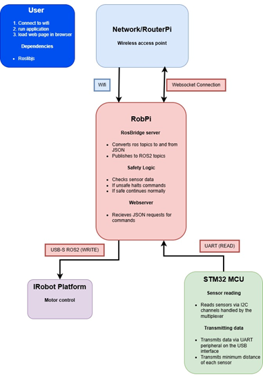

# stm32-tof-collision-monitor
# Multi-Zone Collision Detection System

## Project Overview
This project implements a high-performance obstacle detection system for autonomous mobile robots (AMRs). By fusing data from six **VL53L8CX Time-of-Flight (ToF)** sensors, the system provides a near-360° safety perimeter. It was developed to upgrade an iRobot Create 3 platform with safety overrides.

*(Figure 1 from Technical Report: High-level data flow between STM32, Raspberry Pi, and ROS2 nodes)*

## Key Features
* **Sensor Fusion:** Aggregates real-time distance data from **6x VL53L8CX sensors**, each providing an 8x8 zone resolution (64 data points per sensor).
* **I2C Multiplexing:** Solves I2C address conflicts (all sensors share address `0x29`) using a **TCA9548A Multiplexer**, enabling individual polling of devices on a single bus.
* **Low Latency:** Achieved a system-wide response time of **<100ms** (from detection to motor stop command) with a sensor ranging frequency of **15 Hz**.
* **Embedded Logic:** Custom STM32 firmware filters "dead zones" and extracts minimum distance values before transmitting serialized data via UART to the main controller.

## Hardware Stack
* **Microcontroller:** STM32 Nucleo-144 (Cortex-M7)
* **Sensors:** 6x VL53L8CX (Time-of-Flight, Multizone)
* **Connectivity:** TCA9548A I2C Multiplexer (1-to-8 channels)
* **Host Integration:** Raspberry Pi 5 (Network/OpenWRT) & Raspberry Pi 4 (ROS 2 Humble middleware)

*(Figure 3 from Technical Report: Sensor array wiring topology)*
(Only 4 sensors are drawn in the diagram, this is just for simplicity)

## Technical Challenges & Solutions
## Technical Challenges & Solutions
* [cite_start]**Integration of Novel Hardware:** The VL53L8CX is a cutting-edge sensor with limited public documentation/examples[cite: 318]. [cite_start]The team successfully reverse-engineered the necessary wiring maps and I2C configurations by manually debugging the relationship between the STM32 HAL and the sensor's physical pinout[cite: 315, 316, 317].
* [cite_start]**Firmware Management:** Unlike standard sensors, the VL53L8CX is RAM-based and requires a full firmware upload at every power cycle[cite: 179]. [cite_start]We implemented a robust boot sequence in C to handle this upload and verify sensor integrity before entering the main control loop[cite: 181, 182].
* **Data Throughput:** Optimized the I2C polling cycle to handle high-bandwidth data from 384 total zones (6 sensors x 64 zones) while maintaining a 15 Hz refresh rate.

## Documentation
please refer to the **[Technical System Report](docs/Technical_Report_STM32_ToF_Collision_Avoidance.pdf)**.

---
*Status: Archived. This repository serves as the technical documentation and architecture reference for the project.*
